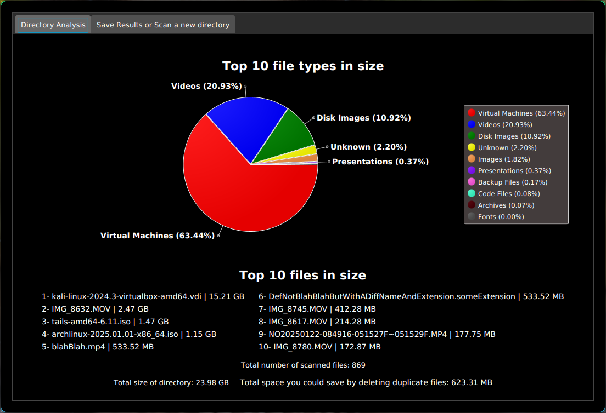

# File-System-Analyzer
A multi-threaded java GUI program, Scanners directories, breaks down disk usage, detects duplicate files, draws chart, and outputs a results file with a complete analysis.
#
 
